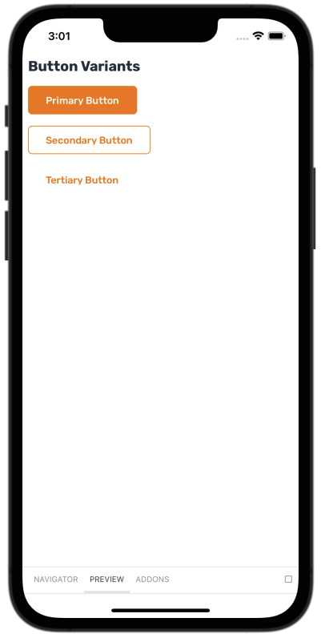
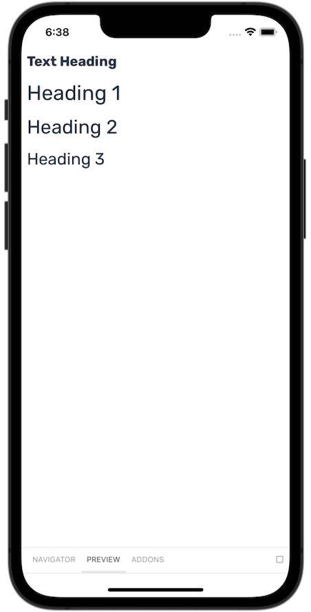

# Baklava React Native

Baklava is a design system provided by <a href="https://github.com/trendyol" target="_blank">Trendyol</a> to create a consistent UI/UX for app users.

It is built on top of React Native and Restyle, allowing you to develop apps for Android and iOS. Our target is providing a UI library that has neatly designed and developed for providing best possible user experience for the users of applications that uses Baklava DS.

<br/>

<div>
  
  
  
</div>

<br>

## Getting Started

Refer to the [getting started guide](https://trendyol.github.io/baklava-react-native/?path=/docs/documentation-welcome--page) for instructions.

## Installation

Open a Terminal in your project's folder and run:

```bash
npm install @trendyol/baklava-react-native
```

You also need to install react-native-svg.

```bash
npm install react-native-svg
```

For expo users you need to install react-native-svg with:

```bash
npx expo install react-native-svg@12.3.0
```

### Run it locally

1. Clone the project

```bash
git clone https://github.com/Trendyol/baklava-react-native.git
```

2. Install dependencies

```bash
cd baklava-react-native

npm install
```

3. Run the cross-platform app

```bash
`npm run ios` or `npm run android`
```

## Example App

An examples application has been created on expo snack to try baklava-react-native without installing it.

baklava-react-native can be tested by downloading the <a href="https://expo.dev/client" target="_blank">Expo Go</a> application and scanning the qr from ios/android devices -> [baklava-react-native-example](https://snack.expo.dev/@ergenekonyigit/baklava-react-native-example)

## Documentation

Check the components and their usage in our [documentation](https://trendyol.github.io/baklava-react-native).
